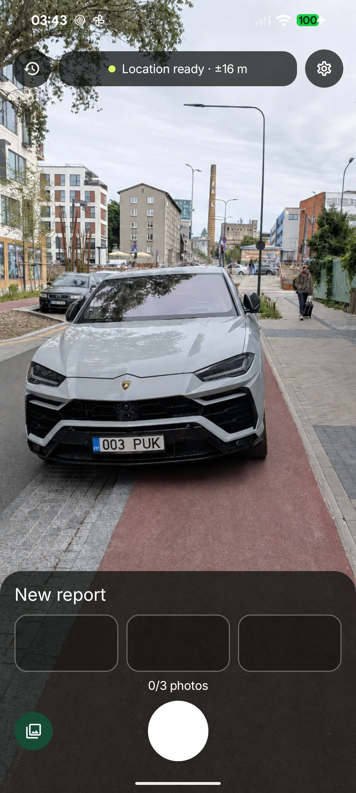
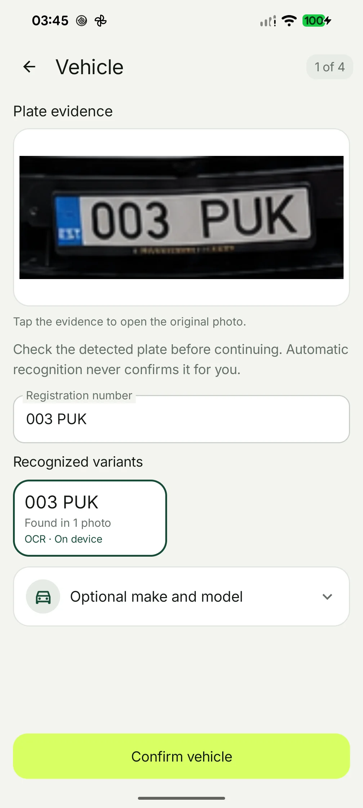
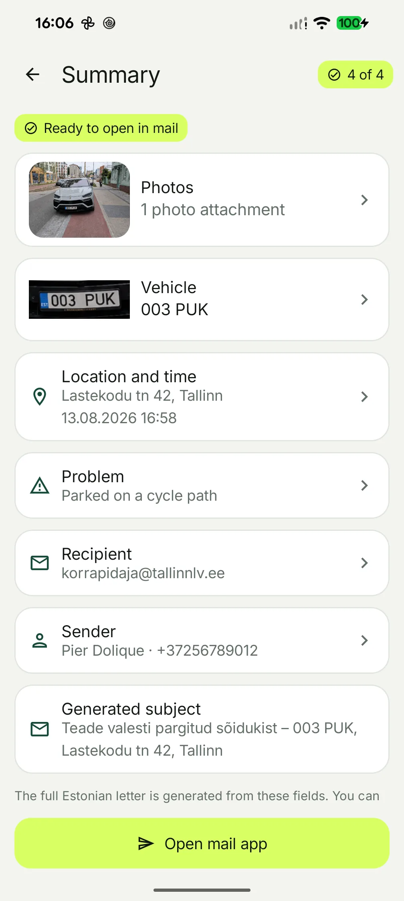

# Pole parkla!

A free Android and iPhone app for preparing reports about vehicles parked on cycle
or pedestrian paths in Estonia. Add photos, check the details, and open a ready
Estonian letter in your mail app. You decide whether to edit or send it.

[Website](https://poleparkla.ee) ·
[Google Play](https://play.google.com/store/apps/details?id=com.perdolique.poleparkla) ·
[Bug reports and ideas](https://github.com/Perdolique/pole-parkla/issues)

| Capture | Check the evidence | Prepare the letter |
| --- | --- | --- |
|  |  |  |

## What it does

- Take or select one to three photos and keep local drafts and history.
- Read number plates on the device with bundled OCR and recognition models.
- Check the vehicle, place, time, and violation before preparing a report.
- Use built-in cycle-path and pedestrian-path violations or your own templates.
- Open an Estonian letter with photo attachments in your mail app.
- Use the app in Estonian, English, or Russian.

Android supports optional cloud recognition through the companion Worker. iPhone
recognition runs entirely on the device. Android requires an ARM64 device with
Android 8.0 or later; the iPhone app requires iOS 18 or later.

## Your data

Reports and photos stay on your device. There are no accounts, ads, analytics, or
background sync. Address search and map tiles need internet access; Android cloud
recognition uploads a photo only when you request it. See the
[privacy policy](PRIVACY.md) for the complete data path.

## Build and explore

The native apps use Kotlin and Jetpack Compose on Android, and Swift and SwiftUI
on iPhone. The optional recognition service runs on Cloudflare Workers, and the
website uses Astro.

- [Development guide](docs/development.md) — app builds, signing, and architecture.
- [Recognition Worker](worker/README.md) — setup and deployment.
- [Website](site/README.md) — local development and deployment.
- [CI runs](https://github.com/Perdolique/pole-parkla/actions/workflows/ci.yml) — Android, Worker, and website checks. iOS tests are deferred for now.

## Bug reports and ideas

[Open an Issue](https://github.com/Perdolique/pole-parkla/issues) to report a bug or
suggest an idea. External pull requests are not accepted for now. See
[CONTRIBUTING.md](CONTRIBUTING.md).

## License

App code is **GPL-3.0-only**; the recognition Worker is **AGPL-3.0-only**. The mobile
app has extra permissions for Google SDK linking and Apple App Store distribution.
Third-party assets keep their own licenses. See [LICENSING.md](LICENSING.md) for
full terms and notices.
